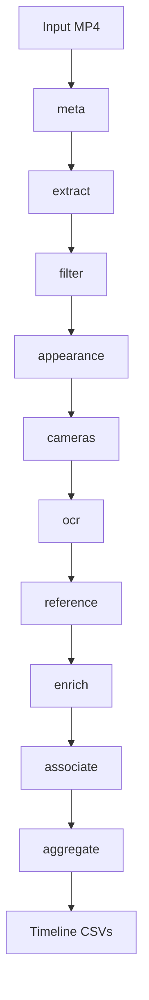
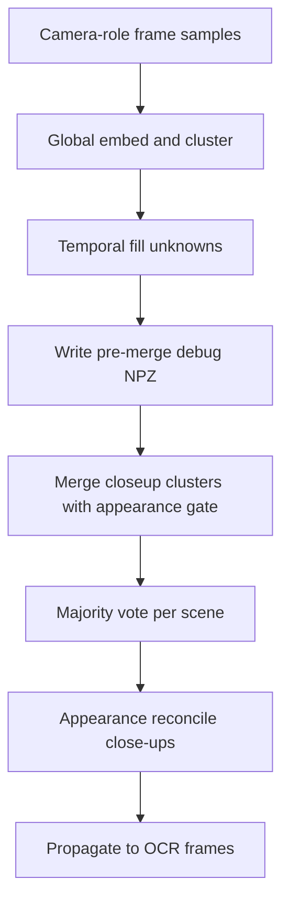

# Broadcast Pipeline — Final Handoff Document

This document explains the broadcast video processing pipeline from end to end: what problem it solves, how data flows through each stage, why the major design choices were made, and how to run, tune, and debug the system. It is written for humans taking over the project — engineers, reviewers, and operators — not as machine-readable context.

For a hands-on walkthrough with runnable cells, see [notebooks/broadcast_pipeline_colab_guide.ipynb](../notebooks/broadcast_pipeline_colab_guide.ipynb).

---

## 1. Executive summary

### The problem

Sports broadcasts mix many camera angles, scene cuts, and on-screen graphics (score bugs, logos, sponsor bands). The goal of this pipeline is to turn a raw `.mp4` video into **structured per-camera text timelines**: for each physical camera, when did each piece of on-screen text appear, for how long, and with what confidence?

### The outcome

After a full run, the primary deliverables are:

- `aggregated_complete.csv` — timeline rows where OCR text matched an approved canonical string exactly
- `aggregated_partial.csv` — timeline rows where only a fragment of the canonical text was visible
- `pipeline_summary.json` — run statistics (scene count, camera count, frame counts, etc.)

A typical run on a full match might produce hundreds of scenes, dozens of discovered cameras, and thousands of OCR observations. Example from a real run: 206 scenes, 35 cameras, 3,700 OCR frames.

### How it works at a glance

The pipeline is ten ordered stages orchestrated by `run_pipeline()` in `src/broadcast_pipeline/orchestrator.py`. Each stage reads and writes CSV, JSON, or JPEG artifacts under `--output-dir` so that long runs can be resumed after a crash, partially re-run from a midpoint, and inspected by humans between steps without re-processing the entire video.



**Stage order:** `meta → extract → filter → appearance → cameras → ocr → reference → enrich → associate → aggregate`

### Current workflow (what happens on a default run)

When you invoke `python main.py` with no extra flags, the orchestrator executes every stage in order, using the defaults defined in `PipelineConfig` (`src/broadcast_pipeline/config.py`). The run begins with **preflight**, which verifies that importable dependencies exist for the requested stage range and warns if a GPU stack is expected but incomplete. **meta** probes the input video so downstream sampling knows the true frame rate and duration. **extract** finds hard scene cuts with PySceneDetect, then writes a sparse set of camera-sample JPEGs and a denser set of OCR-sample JPEGs into `{output_dir}/frames/`, recording uses `frame_index.csv` as the master index of every sampled frame and its role.

**filter** labels each scene as `full_court` or `closeup` using a trained HSV+MLP classifier; this label is informational for analysis and for close-up-specific camera logic, but it does not block later stages. **appearance** runs YOLO11n person segmentation on camera-sample frames, extracts left-to-right clothing color signatures per scene, and writes `scene_appearance.csv` so that close-up camera merges can be blocked when player colors clearly disagree. **cameras** is the heaviest stage in the default profile: it embeds all camera-role frames with a ResNet50 + DINOv2 ensemble, clusters them globally, applies temporal fill and close-up merge stabilizers, majority-votes one camera ID per scene, and then reconciles close-up scenes whose appearance signatures conflict within the same voted camera. Every OCR frame inherits the scene’s final camera ID via `frame_assignments.csv`.

**ocr** runs RapidOCR on OCR-role frames with CLAHE upscaling, gating unread overlay regions to the `UNK` token unless `--enable-vlm` is set. **reference** merges newly discovered OCR tokens into `approved_text_reference.csv`, auto-approving new rows by default so association has targets on the first pass. **enrich** stabilizes flickering score-bug detections across contiguous camera runs inside each scene before **associate** maps tokens to approved reference strings using exact match or LCS partial match. **aggregate** rolls frame-level associations into per-camera text timelines with durations and frame ranges, writing `aggregated_complete.csv`, `aggregated_partial.csv`, and `pipeline_summary.json` as the primary deliverables.

The default run therefore optimizes for **accuracy over speed**: ensemble camera clustering, appearance-gated close-up reconciliation, 2 Hz OCR sampling, and temporal enrichment are all enabled without any CLI flags. Operators who need faster iteration on CPU can pass `--fast-cameras` to swap embedding clustering for HSV histograms, or reduce `--ocr-samples-per-sec` to cut OCR cost.

### Runtime profiles

| Profile | When to use | Camera method | Appearance | Typical hardware |
|---------|-------------|---------------|------------|------------------|
| **Full** (default) | Production-quality camera ID on tennis-style broadcasts | ResNet50 + DINOv2 ensemble vote | Enabled; gates close-up merge and reconcile | GPU recommended for cameras and OCR (`accelerator=auto`) |
| **Fast** (`--fast-cameras`) | CPU-only machines, quick iteration, Colab free tier | HSV histogram clustering only | Still runs if enabled; merge/reconcile use appearance when artifacts exist | CPU sufficient |

Entry points:

- CLI: `main.py` — exposes the most common operational flags; many tuning fields exist only on `PipelineConfig` (see section 6).
- Programmatic: `run_pipeline(PipelineConfig(...))` — full control over every default listed in section 10.

---

## 2. Problem context and assumptions

The pipeline was designed for **tennis (or similar court-sport) broadcasts** where cameras are fixed in position during play. Every design decision below follows from that domain.

### Assumptions that make the system work

| Assumption | Why it matters |
|------------|----------------|
| Camera positions are fixed during play | Visual clustering (embeddings or HSV) produces stable camera fingerprints |
| Broadcast mixes full-court shots and player close-ups | Camera ID cannot rely on court geometry alone; embeddings handle close-ups |
| On-screen graphics repeat across cuts | A reference catalog plus temporal enrichment stabilize text over time |
| A human may curate the text catalog | Association only maps to **approved** entries in the reference CSV |
| Scene cuts are detectable | PySceneDetect `ContentDetector` finds hard cuts between shots |

### Valid use cases

- Fixed gantry or hard-mounted broadcast cameras
- Wide-angle court-dominant shots mixed with player close-ups
- Unknown number of cameras in advance (DBSCAN/HDBSCAN discovers clusters)
- Replays absent or manually filtered beforehand

### Known failure modes

| Condition | What degrades |
|-----------|---------------|
| Actively panning/tilting cameras | Camera fingerprints shift; clustering becomes unreliable |
| Hawk-Eye or virtual-camera replays | No real camera geometry or consistent background |
| Wrong scene-type labels when stratified clustering is enabled | Close-up and full-court pools get mis-assigned |
| Very short matches | DBSCAN `min_samples` may drop minority cameras |
| Heavy motion graphics | OCR produces noise; more entries land in `dropped_text.csv` |

### Approaches we explored but did not ship in the main pipeline

**Vanishing-point (VP) geometry.** An earlier design estimated camera pose from court line intersections (white-line detection → RANSAC VP → DBSCAN on VP coordinates). This works when the court is visible but **breaks on player close-ups**: garbage VPs from non-court frames silently contaminate clusters. The scene classifier was meant to gate VP estimation, but close-ups remain too common for VP-only assignment to be reliable.

**Homography / 2D→3D court reconstruction.** Code exists under `src/camera_assignemnt/homography/` for court mapping and evaluation (`scripts/eval_homography.py`). This path is **out of scope** for `run_pipeline()` — it does not feed camera ID or OCR in the current workflow.

**What we shipped instead:** global visual embeddings (ResNet50 + DINOv2) clustered with DBSCAN/HDBSCAN, with an HSV fast path for CPU-only runs. Embeddings work on close-ups because background lighting, crowd color, and framing differ by camera position even when no court is visible.

---

## 3. Architectural decisions

Each decision below uses the same structure: what we chose, what we rejected, why, trade-offs, and where it lives in code.

---

### D1 — Artifact-centric staged pipeline

**Decision:** Ten stages, each writing CSV/JSON/JPEG artifacts to `output_dir`. Stages can be skipped on resume when outputs already exist.

**Alternatives considered:** Single in-memory pipeline that holds everything until the end.

**Why:** Long videos and ML-heavy stages crash or timeout. Writing artifacts after each stage lets you resume (`--resume`), re-run from a midpoint (`--from-step`), inspect intermediate results, and edit the reference CSV between stages.

**Trade-offs:** More disk usage (many JPEGs and large CSVs). Operators must understand artifact dependencies.

**Where:** `src/broadcast_pipeline/orchestrator.py`, `src/broadcast_pipeline/artifacts.py`, `src/broadcast_pipeline/config.py` (`artifact()` registry)

---

### D2 — PySceneDetect ContentDetector for scene cuts

**Decision:** Detect hard cuts with `ContentDetector(threshold=27.0)`; each detected segment becomes a **scene** with its own `scene_id`.

**Alternatives considered:** Fixed-interval frame sampling without cut detection.

**Why:** Broadcast editing produces clear visual discontinuities at cuts. Scene boundaries are the natural unit for camera voting (one camera label per scene) and for timeline aggregation.

**Trade-offs:** Threshold too low → over-segmentation; too high → missed cuts. Replays and dissolves may not register as clean cuts.

**Where:** `src/broadcast_pipeline/scene_extractor.py`

---

### D3 — Dual frame sampling (sparse camera + dense OCR)

**Decision:** Within each scene, extract two kinds of frames:
- **Camera samples** — evenly spaced (default 5 per scene) for clustering
- **OCR samples** — temporal density (default 2 frames/second) for text capture

A single physical frame can appear twice in `frame_index.csv` with different `sample_role` values (`camera` and `ocr`).

**Alternatives considered:** One sample rate for both tasks.

**Why:** Clustering needs a few representative frames per scene; OCR needs denser temporal coverage to build timelines. Running full OCR on every clustering frame would be wasteful; clustering on every OCR frame would be noisy and slow.

**Trade-offs:** `frame_index.csv` has more rows than unique JPEGs. Camera ID is scene-level, then propagated to OCR frames.

**Where:** `src/broadcast_pipeline/scene_extractor.py` (`camera_sample_frames`, `ocr_sample_frames`)

---

### D4 — Embedding ensemble for camera ID

**Decision:** Default camera method is `ensemble`: extract features with ResNet50 and DINOv2, cluster each backbone separately, then vote to assign a camera ID. Weights and thresholds come from `data/evaluation/ensemble_tuning.json`.

**Alternatives considered:** Vanishing-point geometry (rejected — see section 2). Single backbone only. K-means with fixed K.

**Why:** Embeddings capture background, lighting, and framing fingerprints that persist across full-court and close-up shots without requiring visible court lines. The ensemble reduces single-model blind spots. DBSCAN/HDBSCAN avoids needing the camera count upfront.

**Trade-offs:** Requires PyTorch and significant GPU memory on long videos. Slower than HSV. First run downloads model weights.

**Where:** `src/camera_assignemnt/embedding_cluster/pipeline.py`, `src/broadcast_pipeline/camera_assignment.py`

---

### D5 — HSV fast path

**Decision:** `--fast-cameras` forces `method=hsv` — multi-region HSV histogram features with no torch models.

**Alternatives considered:** Always loading the full ensemble.

**Why:** Enables CPU-only development, Colab free tier, and quick sanity checks without GPU setup.

**Trade-offs:** Lower accuracy, especially on close-ups where color histograms are less discriminative.

**Where:** `main.py` (`--fast-cameras`), `src/broadcast_pipeline/camera_assignment.py` (`_run_clustering`)

---

### D6 — Scene-type classifier (informational today)

**Decision:** Classify each scene as `full_court` or `closeup` via HSV region histograms + trained MLP; majority vote over camera-sample frames per scene. Output: `scene_types.csv`.

**Alternatives considered:** Hard-gating — skip VP/embedding on close-ups only. Using scene type to block OCR.

**Why:** Documents scene mix for analysis and visualization. `scene_types.csv` does **not** gate cameras or OCR — it is informational (and used by close-up merge to identify which clusters are close-ups).

**Trade-offs:** Misclassified scene types do not directly affect camera clustering today.

**Where:** `src/broadcast_pipeline/scene_filter.py`, `src/camera_assignemnt/scene_classifier/classifier.py`

---

### D7 — Scene-level camera vote, then propagate

**Decision:** Cluster camera-sample frames → majority vote per scene → assign that `camera_id` to **all** frames in the scene (including OCR samples).

**Alternatives considered:** Independent per-frame camera labels only.

**Why:** A broadcast scene (between cuts) almost always stays on one camera. Scene-level voting is more stable than per-frame clustering noise.

**Trade-offs:** Rare mid-scene camera switches within a single detected scene are missed. Tie-breaking uses previous scene winner, then mid-frame sample.

**Where:** `src/broadcast_pipeline/camera_assignment.py` (`majority_vote_per_scene`)

---

### D8 — Post-cluster fixes

**Decision:** After clustering, apply three stabilizers (all on by default):
1. **Temporal fill** — unknown frame labels borrow from neighbors within the scene
2. **Closeup cluster merge** — cosine similarity on debug centroids merges over-segmented close-up clusters (threshold 0.70, max group size 3)
3. **Min vote share** (0.6) — low-confidence majorities fall back to mid-frame assignment

**Alternatives considered:** Raw DBSCAN output only.

**Why:** Close-ups segment too aggressively; sparse samples leave gaps labeled `unknown`; weak majorities should not override a clear mid-frame signal.

**Trade-offs:** Merge can incorrectly combine distinct close-up cameras if threshold is too low.

**Where:** `src/broadcast_pipeline/camera_assignment.py`, `src/broadcast_pipeline/camera_merge.py`

---

### D9 — RapidOCR with readability gating

**Decision:** Run RapidOCR on OCR-role frames with CLAHE upscaling (default scale 1.5). Gate results through readability assessment targeting overlay regions (`score_bug`, `logo`). Unreadable regions get the `UNK` token (default `"UNK"`).

**Alternatives considered:** Cloud vision on every frame.

**Why:** Offline-capable, fast, and tunable. Readability gating avoids treating random court pixels as text.

**Trade-offs:** Small or low-contrast graphics may be missed without VLM escalation.

**Where:** `src/scene_ocr/extractor.py`, `src/scene_ocr/readability.py`, `src/broadcast_pipeline/ocr_runner.py`

---

### D10 — VLM as optional escalation

**Decision:** `--enable-vlm` routes hard crops to an OpenAI vision model. Default is off.

**Alternatives considered:** Mandatory cloud vision for all ambiguous regions.

**Why:** Cost, latency, and API dependency control. The pipeline must run fully offline for development and batch processing.

**Trade-offs:** Without VLM, more `UNK` tokens and dropped associations.

**Where:** `src/scene_ocr/vlm_client.py`, `main.py` (`--enable-vlm`)

---

### D11 — Human-in-the-loop reference CSV

**Decision:** `approved_text_reference.csv` is the canonical catalog of on-screen text. The `reference` stage auto-discovers tokens from OCR; new entries default to `approved=True`. The `associate` stage only maps to rows where `approved` is true.

**Alternatives considered:** Free-form fuzzy matching without a curated catalog.

**Why:** Graphics text has consistent canonical spellings ("US OPEN", player names) but noisy OCR output. Humans can flip `approved` to false, fix spellings, or add missing entries between runs.

**Trade-offs:** Requires a human review step for production-quality association. Auto-approval of new text can let garbage through if not reviewed.

**Where:** `src/broadcast_pipeline/text_reference.py`, `src/broadcast_pipeline/text_associate.py`

---

### D12 — Temporal enrichment before association

**Decision:** Within each scene, group OCR frames into **camera runs** (contiguous frames with the same `camera_id`). IoU-match detections across time to borrow text from neighbors. Output: `frame_ocr_enriched.csv`.

**Alternatives considered:** Associate raw OCR directly.

**Why:** Score bugs flicker frame-to-frame — one frame reads "SINN" and the next "SINNER". Enrichment stabilizes detections before mapping to reference text.

**Trade-offs:** Incorrect IoU matches can propagate wrong text. Enrichment is skippable via `enrich_enabled=False`.

**Where:** `src/broadcast_pipeline/text_enrich.py`

---

### D13 — LCS association (not edit distance)

**Decision:** Map partial OCR tokens to approved reference strings using longest-common-subsequence (LCS) score, minimum 0.6, minimum 3 matching characters.

**Alternatives considered:** Levenshtein edit distance.

**Why:** Partial scoreboard crops often show suffixes or prefixes of the full string. LCS handles subsequence overlap better than character edits on noisy OCR.

**Trade-offs:** Short tokens can false-match if the reference catalog is large. Tune `association_min_score` and review `dropped_text.csv`.

**Where:** `src/broadcast_pipeline/text_associate.py`

---

### D14 — Lazy imports and memory hygiene

**Decision:** Heavy dependencies (torch, rapidocr) import only when their stage runs. `gc.collect()` runs after extract, filter, appearance, and cameras. OCR supports configurable GC interval on GPU.

**Alternatives considered:** Eager import of all ML libraries at startup.

**Why:** Long videos on limited RAM/GPU benefit from releasing models between stages.

**Trade-offs:** Slightly more complex orchestrator code.

**Where:** `src/broadcast_pipeline/orchestrator.py`, `src/broadcast_pipeline/ocr_runner.py`

---

### D15 — Person appearance for close-up camera disambiguation

**Decision:** Before camera clustering, run YOLO11n-seg (ONNX) on camera-sample frames to build per-scene clothing color signatures. Use those signatures **after** global embedding clustering to block incompatible close-up cluster merges and to split scenes that received the same voted `camera_id` but show clearly different player colors.

**Alternatives considered:** Inject appearance features directly into the embedding cluster step; hard-gate clustering by scene type.

**Why:** Close-up shots over-segment aggressively in embedding space because backgrounds are similar, but player kit colors (left-to-right order and count) often differ between physical cameras. Post-hoc constraints avoid polluting the global embedding space while still fixing the most common close-up errors.

**Trade-offs:** Adds an ONNX segmentation stage and model download step. Full-court scenes are excluded from reconcile (`is_appearance_eligible`); appearance does not change full-court assignments today.

**Where:** `src/broadcast_pipeline/appearance_filter.py`, `src/broadcast_pipeline/appearance_compat.py`, `src/person_appearance/`

---

### Camera clustering sub-flow



---

## 4. Pipeline walkthrough

Each subsection follows the same structure: purpose, inputs, what happens, outputs, defaults (with intuition for why those values exist), operational notes, and module path. Together they describe the **current** implementation as wired in `orchestrator.py`; if code and this document disagree, trust the code and update this file.

### Resume and partial-run behavior (applies to all stages)

With `--resume`, a stage is skipped when its primary output artifact already exists on disk. OCR and enrich use **completeness checks** rather than mere file presence: OCR skips only when every expected `(scene_id, frame_number)` key from `frame_index.csv` appears in `frame_ocr.csv`, and enrich skips only when enriched row count matches raw OCR row count. The **reference** stage always runs when reached, because new OCR tokens may have appeared since the last catalog update. Camera assignment is skipped when both `scene_assignments.csv` and `frame_assignments.csv` exist — if you change clustering code or tuning weights, delete those files or run `--from-step cameras` without expecting a silent refresh under `--resume`. `--from-step` and `--to-step` select an inclusive slice of `STAGE_ORDER`; when `--from-step` is not `all`, `validate_stage_inputs()` verifies upstream artifacts exist before the run starts.

---

### Preflight (always runs)

**Purpose:** Validate that required Python packages are importable for the requested stage range. Warn if GPU stack is missing when ensemble cameras or GPU OCR are expected.

**Inputs:** `PipelineConfig`, resolved stage list.

**What happens:**
1. Check imports per stage (`scenedetect`, `cv2`, `torch`, `rapidocr`, etc.)
2. Abort early with a clear message if a required package is missing

**Outputs:** None (in-memory checks only).

**Operational notes:** Always runs even with `--resume`. Fix missing extras via `pip install -e '.[embedding,ocr]'` (see section 6).

**Module:** `src/broadcast_pipeline/preflight.py`

---

### Stage 1: meta

**Purpose:** Probe the input video for frame rate, duration, resolution, and frame count. Downstream stages need accurate FPS for OCR sampling and timeline duration math.

**Inputs:** `--video` path (MP4).

**What happens:**
1. Open video with OpenCV and PySceneDetect
2. Record FPS (source tagged as `scenedetect`, `opencv`, or hybrid), frame count, width, height, duration

**Outputs:** `video_meta.json`

**Key defaults:** None (always probes the configured video).

**Operational notes:** Skipped on `--resume` if `video_meta.json` exists.

**Module:** `src/broadcast_pipeline/video_meta.py`

---

### Stage 2: extract

**Purpose:** Detect scene cuts and extract sampled frames to disk.

**Inputs:** Video file, `video_meta.json`.

**What happens:**
1. Run PySceneDetect `ContentDetector` with `detector_threshold` (default 27.0)
2. For each scene, compute camera sample frames (evenly spaced, default 5) and OCR sample frames (default 2 Hz)
3. Single sequential video scan writes only needed JPEGs to `frames/scene_{id}_frame_{n}.jpg`
4. Build `frame_index.csv` with one row per (scene, frame, role) — a frame can have both `camera` and `ocr` roles

**Outputs:**
- `scenes.json` — cut boundaries (`scene_id`, `start_frame`, `end_frame`, times)
- `frame_index.csv` — columns include `scene_id`, `frame_number`, `frame_path`, `sample_role`, `timecode`, `seconds`, `width`, `height`
- `frames/*.jpg`

**Key defaults and why they are set this way:**

| Field | Default | Intuition |
|-------|---------|-----------|
| `camera_samples_per_scene` | `5` | Evenly spaced samples across each shot give clustering enough diversity without reading every frame. |
| `ocr_samples_per_sec` | `2.0` | At typical 25–50 fps broadcast feeds, 2 Hz yields one OCR frame every 12–25 source frames — enough for timeline continuity. |
| `detector_threshold` | `27.0` | PySceneDetect content score threshold; lower values create more scenes (over-segmentation), higher values miss soft cuts. |

**Operational notes:** This stage is the largest disk consumer because it materializes every sampled JPEG under `{output_dir}/frames/`. Skipped on `--resume` when both `frame_index.csv` and `scenes.json` exist.

**Module:** `src/broadcast_pipeline/scene_extractor.py`

---

### Stage 3: filter

**Purpose:** Label each scene as `full_court` or `closeup` based on majority vote over camera-sample frames.

**Inputs:** `frame_index.csv` (camera-role rows), extracted JPEGs.

**What happens:**
1. Classify each camera frame using multi-region HSV histograms + trained MLP
2. Majority vote per scene → `scene_type`

**Outputs:** `scene_types.csv` — columns: `scene_id`, `scene_type`, `vote_counts_json`

**Key defaults:** Uses bundled scene classifier model paths in `src/camera_assignemnt/scene_classifier/`.

**Operational notes:** **Informational only** — does not gate downstream stages today. Skipped on `--resume` if `scene_types.csv` exists.

**Module:** `src/broadcast_pipeline/scene_filter.py`

---

### Stage 4: appearance

**Purpose:** Detect people on camera-sample frames with YOLO11n-seg (ONNX), extract per-person clothing colors, and build scene-level appearance signatures used to constrain close-up camera assignment.

**Inputs:** `frame_index.csv` (camera-role rows), `scene_types.csv`, extracted JPEGs.

**What happens:**
1. Run `yolo11n-seg.onnx` person instance segmentation on each camera-sample frame
2. Extract torso-dominant clothing color per person (gray-world balance → LAB → primary palette)
3. Majority vote per scene → person count + left-to-right color sequence
4. Write per-frame and per-scene appearance artifacts

**Outputs:**
- `frame_appearance.csv` — per-frame person count, colors, confidence, status
- `scene_appearance.csv` — `scene_id`, `scene_type`, `person_count`, `person_colors_json`, `appearance_signature`, `confidence`, `status`

**Key defaults and why they are set this way:**

| Field | Default | Intuition |
|-------|---------|-----------|
| `appearance_enabled` | `True` | Close-up camera errors are common without player-color constraints; disabling skips the stage entirely and makes merge/reconcile no-ops. |
| `appearance_imgsz` | `640` | Standard YOLO input size; balances segmentation quality and ONNX throughput on CPU/GPU. |
| `appearance_min_confidence` | `0.5` | Detections below this threshold are ignored so distant crowd blobs do not become false “players.” |
| `appearance_color_tolerance` | `18.0` (LAB ΔE) | Two color labels within this perceptual distance are treated as the same kit color, tolerating lighting variation. |
| `appearance_count_slack` | `1` | Allows ±1 person count mismatch when comparing scenes, because segmentation sometimes misses a partial body at frame edges. |
| `appearance_min_sequence_match` | `2` | At least two left-to-right color matches are required before two close-up signatures are considered compatible. |
| `appearance_color_method` | `"histogram_hsv"` | HSV histogram mode is more stable than single-pixel median LAB on textured kits. |
| `appearance_color_mask_region` | `"torso"` | Torso masks ignore legs and background better than full-body boxes for kit color. |
| `appearance_dominant_track_policy` | `"consistent"` | Prefers the person track that appears most consistently across camera samples in a scene, not merely the largest box once. |
| `appearance_track_match_iou` | `0.3` | Links person detections across frames within a scene when boxes overlap modestly. |
| `appearance_mask_erode_px` | `1` | Erodes segmentation masks slightly to drop background bleed at clothing boundaries. |
| `appearance_histogram_h_bins` | `32` | Hue histogram resolution for color naming; 32 bins is a practical default for broadcast kit discrimination. |
| `appearance_model_path` | `models/person_seg/yolo11n-seg.onnx` | Bundled lightweight segmenter; override only if you ship a custom ONNX export. |

**Camera integration (post-global refine only):**
- **Close-ups:** hard constraint applied **after** global ensemble clustering — incompatible merges are blocked and post-vote reconciliation can split bad assignments within a voted `camera_id`
- **Full court:** excluded from appearance reconcile (`is_appearance_eligible`); appearance features are **not** injected into embedding clustering in the current workflow (see `test_run_clustering_does_not_pass_appearance_features`)

**Operational notes:** Requires `pip install -e '.[appearance]'` and `python scripts/download_person_seg_model.py` to provision ONNX weights under `models/person_seg/`. Skipped on `--resume` when `scene_appearance.csv` and `frame_appearance.csv` both exist. Set `appearance_enabled=False` in `PipelineConfig` to disable the stage when iterating on unrelated stages or when the segmenter model is unavailable.

**Modules:** `src/broadcast_pipeline/appearance_filter.py`, `src/person_appearance/`

---

### Stage 5: cameras

**Purpose:** Assign a `camera_id` to every scene and propagate to all sampled frames.

**Inputs:** `frame_index.csv`, `scene_types.csv` (for close-up merge), `scene_appearance.csv` (for appearance-gated merge/reconcile), extracted frames, `data/evaluation/ensemble_tuning.json` (ensemble weights).

**What happens (fixed order):**
1. **Global ensemble cluster** on all camera-role samples (single pass; no pre-cluster pool stratification)
2. Temporal fill for unknown labels within scenes
3. Write `camera_clustering_debug.npz` (pre-merge cluster IDs — used by reconcile label reuse)
4. **Close-up merge** — merge similar close-up cluster centroids (blocked when appearance signatures conflict)
5. **Majority vote** per scene with tie-breakers (previous scene, mid-frame)
6. **Appearance reconcile** — split incompatible close-up scenes that share a voted `camera_id`; reuse pre-merge labels from debug NPZ when possible; skip singleton splits (`camera_reconcile_min_split_size`)
7. Propagate scene `camera_id` to all frames including OCR samples

**Outputs:**
- `scene_assignments.csv` — `scene_id`, `camera_id`, `cluster_id`, `camera_vote_counts_json`, `assignment_method`, `vote_share`
- `frame_assignments.csv` — per-frame `camera_id` for every sampled frame
- `frame_camera_results.csv` — per-frame cluster results after merge (post-merge IDs)
- `camera_clustering_debug.npz` — reduced embeddings and **pre-merge** cluster IDs (when `persist_camera_debug=True`)
- `camera_merge_log.json` — merge groups applied

**Key defaults and why they are set this way:**

| Field | Default | Intuition |
|-------|---------|-----------|
| `ensemble_method` | `"ensemble"` | ResNet50 + DINOv2 vote is the accuracy-first default; overridden to `"hsv"` when `--fast-cameras` is set. |
| `accelerator` | `"auto"` | Picks CUDA, then Apple MPS/CoreML, then CPU for torch and ONNX OCR without manual device flags. |
| `camera_scene_temporal_fill` | `True` | Unknown labels within a scene borrow from neighboring camera samples because a shot usually stays on one camera. |
| `camera_merge_closeup_clusters` | `True` | Close-ups over-segment in embedding space; merging similar centroids reduces camera proliferation. |
| `camera_merge_similarity_threshold` | `0.70` | Cosine similarity on debug centroids; 0.70 merges aggressively enough to collapse duplicates but not so low that distinct angles merge. |
| `camera_merge_max_group_size` | `3` | Caps merge group size so one bad link cannot absorb many unrelated clusters. |
| `camera_min_vote_share` | `0.6` | If the majority holds less than 60% of camera-sample votes, fall back to the mid-frame cluster label instead of a weak plurality. |
| `camera_appearance_reconcile` | `True` | After voting, split close-up scenes that share a `camera_id` but have incompatible player-color signatures. |
| `camera_reconcile_min_split_size` | `2` | Avoids minting a new camera ID for a singleton scene unless at least two scenes would move together. |
| `camera_reconcile_reuse_labels` | `True` | When splitting, prefer pre-merge cluster IDs from `camera_clustering_debug.npz` instead of inventing new `cam_N` labels. |
| `persist_camera_debug` | `True` | Writes NPZ debug artifacts for timeline viz scatter plots and reconcile label reuse; safe to disable only if disk is tight. |

**Operational notes:** Heaviest GPU stage in the full profile. Use `--fast-cameras` for CPU-only HSV clustering. Skipped on `--resume` if both assignment CSVs exist — **delete `scene_assignments.csv` and `frame_assignments.csv`, or re-run with `--from-step cameras` without `--resume`**, to pick up code or tuning changes. Copy `data/evaluation/ensemble_tuning.json` into Colab runtime for tuned ensemble weights.

**Viz:** Camera compare global scatter uses **t-SNE** on ensemble reduced features; dot colors match **post-merge** `cluster_id` from `frame_camera_results.csv`. Scene cards show final `scene_assignments` (vote + reconcile) vs pre-merge debug clusters.

**Eval metrics:** `scripts/analyze_camera_assignment.py` reports `singleton_camera_rate` and `reconcile_split_scenes` alongside Hungarian accuracy.

**Module:** `src/broadcast_pipeline/camera_assignment.py`

---

### Stage 6: ocr

**Purpose:** Extract on-screen text from every OCR-role frame.

**Inputs:** `frame_index.csv` (ocr-role rows), `frame_assignments.csv`.

**What happens:**
1. For each OCR frame, load JPEG and run RapidOCR with optional CLAHE upscale
2. Assess readability in overlay regions; insert `UNK` for unread areas
3. Optionally escalate hard crops to VLM (`--enable-vlm`)
4. Stream rows to `frame_ocr.csv` with periodic flush (crash-safe)

**Outputs:** `frame_ocr.csv` — columns: `scene_id`, `frame_number`, `seconds`, `camera_id`, `words_json`, `detections_json`, `verdict`, `used_unk`

**Key defaults and why they are set this way:**

| Field | Default | Intuition |
|-------|---------|-----------|
| `ocr_scale` | `1.5` | Upscales frames before OCR so small score-bug text remains legible; lower values save memory on long runs. |
| `ocr_preprocess` | `True` | Applies CLAHE contrast normalization, which helps broadcast overlays on varied backgrounds. |
| `ocr_prefetch_workers` | `2` | Overlaps JPEG loading with inference; `0` disables threading for debugging or very slow disks. |
| `ocr_rec_batch` / `ocr_cls_batch` | `None` (backend-aware) | RapidOCR picks batch sizes based on CUDA/CoreML/CPU backend when left unset. |
| `ocr_gc_interval` | `100` | Calls `gc.collect()` every N GPU OCR frames to limit VRAM growth on long matches. |
| `ocr_csv_flush_interval` | `10` | Appends rows to `frame_ocr.csv` frequently so a crash loses at most a handful of frames. |
| `unk_token` | `"UNK"` | Placeholder written when readability gating or missing VLM rejects a crop; association drops UNK tokens. |
| `enable_vlm` | `False` | Cloud vision is opt-in because it adds cost, latency, and API dependency. |

**Operational notes:** Resume uses a **completeness check** — skips only if every expected `(scene_id, frame_number)` key exists in `frame_ocr.csv`. Without `--resume`, an incomplete file is deleted and OCR restarts from scratch.

**Module:** `src/broadcast_pipeline/ocr_runner.py`

---

### Stage 7: reference

**Purpose:** Build and update the human-editable approved text catalog from OCR discoveries.

**Inputs:** `frame_ocr.csv`.

**What happens:**
1. Scan OCR words for plausible complete tokens (excluding `UNK`)
2. Merge new tokens into existing `approved_text_reference.csv`
3. New entries get `approved` per `default_new_text_approved` (default `True`)

**Outputs:** `approved_text_reference.csv` — columns: `complete_text`, `approved`, `first_seen_scene_id`, `first_seen_frame`, `discovery_count`

**Key defaults:** `default_new_text_approved=True`, `reference_csv` defaults to `{output_dir}/approved_text_reference.csv`

**Operational notes:** **Human edit point.** Review this CSV before association — set `approved` to `FALSE` for garbage, fix spellings, add missing graphics. Re-run from `associate` after edits. Reference stage always runs (no skip on resume) to pick up new OCR tokens.

**Module:** `src/broadcast_pipeline/text_reference.py`

---

### Stage 8: enrich

**Purpose:** Stabilize OCR detections temporally within camera runs before association.

**Inputs:** `frame_ocr.csv`, `frame_assignments.csv`.

**What happens:**
1. Group frames by scene, split into contiguous **camera runs**
2. IoU-match detections across frames in each run
3. Borrow text from neighboring frames when a detection is partial or missing
4. Label each detection `good` or `partial` by bbox area vs scene average

**Outputs:** `frame_ocr_enriched.csv` — same columns as `frame_ocr.csv` plus enriched detection metadata in `detections_json`

**Key defaults:** `enrich_enabled=True`, `enrich_region_iou=0.3`, `readability_size_multiplier=1.25`

**Operational notes:** Resume checks completeness against raw OCR row count. Downstream stages prefer enriched file when present. Disable via `enrich_enabled=False` in config.

**Module:** `src/broadcast_pipeline/text_enrich.py`

---

### Stage 9: associate

**Purpose:** Map OCR tokens to approved reference text.

**Inputs:** Enriched OCR (or raw if enrichment skipped), `approved_text_reference.csv`, optional raw OCR for provenance.

**What happens:**
1. For each word in each frame:
   - **Complete** — exact match to approved reference → `text_kind=complete`
   - **Partial** — LCS match above threshold → mapped to canonical `complete_text`
   - **Dropped** — UNK, unapproved, or no match → written to `dropped_text.csv` with reason

**Outputs:**
- `frame_text_associated.csv` — `scene_id`, `frame_number`, `camera_id`, `raw_text`, `text_kind`, `mapped_complete_text`, `mapping_confidence`, `readability_label`, `bbox_json`, `enrich_applied`, `ocr_raw_text`
- `dropped_text.csv` — columns: `scene_id`, `frame_number`, `camera_id`, `raw_text`, `reason` (`unk_or_empty`, `unapproved`, `no_match`)

**Key defaults:** `association_min_score=0.6`, `association_min_match_chars=3`

**Operational notes:** Skipped on `--resume` if both output CSVs exist. Review `dropped_text.csv` to tune reference or thresholds.

**Module:** `src/broadcast_pipeline/text_associate.py`

---

### Stage 10: aggregate

**Purpose:** Build per-camera text timelines with durations and frame ranges.

**Inputs:** `frame_text_associated.csv`, processed OCR, `scenes.json`, `video_meta.json`, reference CSV.

**What happens:**
1. Group by `(camera_id, text)` separating complete vs partial kinds
2. Compute slot durations from frame spacing and scene end boundaries
3. Merge contiguous frame ranges
4. Track readability and enrichment counts per row
5. Write summary JSON

**Outputs:**
- `aggregated_complete.csv`
- `aggregated_partial.csv` — columns: `camera_id`, `text`, `text_kind`, `mapped_complete_text`, `total_duration_sec`, `frame_ranges`, `n_frames_present`, `n_frames_good`, `n_frames_partial`, `n_frames_enriched`, `dominant_readability`
- `pipeline_summary.json`

**Key defaults:** None beyond upstream config.

**Operational notes:** Always runs when reached; writes final deliverables.

**Module:** `src/broadcast_pipeline/aggregator.py`

---

### Output directory layout

After a full run, `data/pipeline/` (or your `--output-dir`) typically contains:

```
{output_dir}/
├── video_meta.json
├── scenes.json
├── frame_index.csv
├── scene_types.csv
├── frame_appearance.csv             # per-frame person segmentation (appearance stage)
├── scene_appearance.csv             # per-scene clothing signatures (appearance stage)
├── scene_assignments.csv
├── frame_assignments.csv
├── frame_camera_results.csv
├── camera_clustering_debug.npz      # optional debug
├── camera_merge_log.json            # optional debug
├── frame_ocr.csv
├── frame_ocr_enriched.csv
├── approved_text_reference.csv
├── frame_text_associated.csv
├── dropped_text.csv
├── aggregated_complete.csv
├── aggregated_partial.csv
├── pipeline_summary.json
├── frames/
│   └── scene_{id}_frame_{n}.jpg
└── camera_collages/                 # from render script, not pipeline
    └── cam_{id}.jpg
```

---

## 5. Data model and artifact contracts

### Scenes, frames, and camera runs

- **Scene** — one continuous shot between hard cuts (`scene_id` from PySceneDetect). Camera ID is chosen once per scene via majority vote.
- **Frame** — a specific frame number within a scene. Two sampling roles exist in `frame_index.csv`:
  - `camera` — used for clustering (sparse)
  - `ocr` — used for text extraction (dense)
- **Camera run** — within a scene, a contiguous sequence of OCR frames sharing the same `camera_id`. Enrichment operates within runs.

### Reference CSV schema

| Column | Meaning |
|--------|---------|
| `complete_text` | Canonical on-screen string |
| `approved` | `TRUE`/`FALSE` — only approved rows are association targets |
| `first_seen_scene_id` | Where the token was first discovered |
| `first_seen_frame` | Frame number of first discovery |
| `discovery_count` | How many OCR observations contained this token |

**Human workflow:** After `reference`, open the CSV in a spreadsheet editor. Set `approved=FALSE` for noise. Fix spellings. Add missing graphics manually. Then re-run from `associate`:

```bash
python main.py --output-dir data/pipeline --from-step associate --resume
```

### pipeline_summary.json fields

Example from a real run:

```json
{
  "n_scenes": 206,
  "n_ocr_frames": 3700,
  "n_cameras": 35,
  "n_approved_text": 14,
  "n_new_reference_text": 0,
  "readability_size_multiplier": 1.25,
  "n_frames_good": 7516,
  "n_frames_partial": 24861,
  "n_text_presence_events": 32377,
  "output_dir": "..."
}
```

---

## 6. Running the pipeline

### Installation

The pipeline splits optional dependencies into extras so a minimal install stays light. For the **default full workflow** (ensemble cameras, appearance segmentation, CPU OCR), install:

```bash
pip install -e '.[embedding,ocr,appearance]'   # default-profile CPU run
python scripts/download_person_seg_model.py    # YOLO11n-seg ONNX for appearance stage
```

For GPU-accelerated camera embedding and OCR on NVIDIA hardware:

```bash
pip install -e '.[gpu,appearance]'
python scripts/download_person_seg_model.py
```

Additional extras in `pyproject.toml`:

| Extra | What it adds | When you need it |
|-------|--------------|------------------|
| `embedding` | PyTorch + torchvision | Ensemble camera clustering (default unless `--fast-cameras`) |
| `ocr` | RapidOCR + onnxruntime | OCR stage on CPU |
| `ocr-gpu` | onnxruntime-gpu | Faster OCR on NVIDIA GPU |
| `ocr-vlm` | OpenAI client | `--enable-vlm` escalation |
| `gpu` | torch + RapidOCR GPU stack | Single command for GPU cameras + GPU OCR |
| `appearance` | onnxruntime | Person segmentation for appearance stage |
| `appearance-export` | ultralytics | Re-export YOLO weights to ONNX (maintainers only) |
| `viz` | FastAPI + uvicorn | Timeline web UI (`scripts/serve_timeline_viz.py`) |
| `court` | torch (homography experiments) | Not used by `run_pipeline()` today |

### CLI reference (`main.py`)

The CLI exposes the flags operators change most often. Every other field on `PipelineConfig` remains at its dataclass default unless you construct the config in Python (see section 10).

| Flag | Default | What it controls | Why this default |
|------|---------|------------------|------------------|
| `--video` | `data/Untitled.mp4` | Input MP4 path | Matches the sample asset layout in the repo; override for real matches. |
| `--output-dir` | `data/pipeline` | Root directory for all artifacts | Keeps runs colocated and easy to point the viz server at. |
| `--reference-csv` | `{output_dir}/approved_text_reference.csv` | Human-editable text catalog | Lives beside other artifacts so `--resume` and `--from-step associate` find it automatically. |
| `--camera-samples` | `5` | Camera-role frames extracted per scene | Five evenly spaced samples usually stabilize majority vote without embedding every frame. |
| `--ocr-samples-per-sec` | `2.0` | OCR temporal density (Hz) | Two frames per second captures score-bug flicker on typical broadcast frame rates without full-frame OCR cost. |
| `--ocr-scale` | `1.5` | Upscale factor before RapidOCR | Small on-screen text needs modest upscaling; 1.5 is a memory/speed compromise. |
| `--ocr-rec-batch` | backend-aware (`None`) | RapidOCR recognition batch size | Unset lets the runner pick CUDA/CoreML/CPU-appropriate batches. |
| `--ocr-cls-batch` | backend-aware (`None`) | RapidOCR angle-classifier batch size | Same rationale as recognition batching. |
| `--ocr-prefetch-workers` | `2` | Threads prefetching the next JPEG | Overlaps I/O with inference; increase on fast NVMe, set `0` to debug deterministically. |
| `--enable-vlm` | off | OpenAI vision for hard OCR crops | Off by default so batch runs work offline and without API keys. |
| `--fast-cameras` | off | Forces HSV-only camera clustering | Off by default because embeddings handle close-ups far better than color histograms. |
| `--resume` | off | Skip stages whose output files already exist | Off on first run; enable after crashes or when continuing a partial run. |
| `--from-step` | `all` | First stage to execute (inclusive) | `all` means start at `meta`; use named steps to re-run mid-pipeline slices. |
| `--to-step` | `aggregate` (implicit) | Last stage to execute (inclusive) | Defaults to the final aggregation stage so a bare `main.py` run produces timeline CSVs. |

Valid step names for `--from-step` / `--to-step`: `meta`, `extract`, `filter`, `appearance`, `cameras`, `ocr`, `reference`, `enrich`, `associate`, `aggregate` (plus `all` for from-step only).

### Programmatic-only configuration

These `PipelineConfig` fields are **not** exposed on the CLI but matter for tuning and tests. Set them when calling `run_pipeline(PipelineConfig(...))`:

| Field group | Examples | Typical reason to change |
|-------------|----------|-------------------------|
| Scene detection | `detector_threshold=27.0` | Too many/few PySceneDetect cuts |
| Camera stabilizers | `camera_merge_similarity_threshold`, `camera_min_vote_share` | Close-up over-segmentation or weak majorities |
| Appearance | `appearance_enabled`, `appearance_color_tolerance` | Disable segmenter or relax kit matching |
| OCR internals | `ocr_preprocess`, `ocr_gc_interval`, `unk_token` | Memory hygiene or custom UNK handling |
| Text pipeline | `enrich_enabled`, `association_min_score`, `default_new_text_approved` | Stricter matching or manual reference curation |
| Accelerator | `accelerator="auto"` | Force `"cpu"` on machines without working CUDA/MPS |
| Debug | `persist_camera_debug`, `camera_vlm_collage_qa` | Disk savings or optional VLM QA on collages |

Full defaults with intuition appear in section 10.

### Common run patterns

**Full run:**
```bash
python main.py --video data/match.mp4 --output-dir data/pipeline
```

**Resume after crash:**
```bash
python main.py --output-dir data/pipeline --resume
```

**Re-run cameras only:**
```bash
python main.py --output-dir data/pipeline --from-step cameras --to-step cameras
```

**Re-associate after editing reference CSV:**
```bash
python main.py --output-dir data/pipeline --from-step associate --resume
```

### Stage input dependencies

| Stage | Required artifacts |
|-------|-------------------|
| meta | video file |
| extract | `video_meta.json` |
| filter | `frame_index.csv` |
| appearance | `frame_index.csv`, `scene_types.csv` |
| cameras | `frame_index.csv` |
| ocr | `frame_index.csv`, `frame_assignments.csv` |
| reference | `frame_ocr.csv` |
| enrich | `frame_ocr.csv` |
| associate | `frame_ocr.csv`, reference CSV, `frame_assignments.csv` |
| aggregate | `frame_text_associated.csv`, `scenes.json`, `video_meta.json` |

`validate_stage_inputs()` in `src/broadcast_pipeline/artifacts.py` checks these when `--from-step` is not `all`.

### Import path note (Colab and scripts)

Inner modules import `from src.camera_assignemnt...`, `from src.scene_ocr...`, and `from src.person_appearance...`. Both the **repo root** and `src/` must be on `sys.path`. `main.py` adds `src/` only; for Colab or custom scripts, also add the repo root (see the Colab notebook setup cell).

---

## 7. Debugging and validation toolkit

| Question | Tool |
|----------|------|
| Do camera groupings look sensible? | `scripts/render_camera_collages.py` → `camera_collages/cam_*.jpg` |
| Re-run cameras with metrics delta? | `scripts/rerun_cameras.py` |
| Quantitative camera accuracy vs ground truth? | `scripts/analyze_camera_assignment.py` |
| Browse timelines interactively? | `scripts/serve_timeline_viz.py` + `static/timeline_viz/` |
| Test OCR on a single image? | `scripts/run_ocr.py` |
| Tune OCR throughput? | `scripts/benchmark_ocr.py` |
| Tune ensemble clustering weights? | `scripts/tune_ensemble.py` → `data/evaluation/ensemble_tuning.json` |

### Debug artifacts

| File | Contents |
|------|----------|
| `camera_clustering_debug.npz` | Reduced embedding matrix, cluster IDs, per-member labelings for scatter plots |
| `camera_merge_log.json` | Which close-up clusters were merged and why |
| `frame_camera_results.csv` | Per-frame cluster assignment before scene-level vote |
| `dropped_text.csv` | Tokens rejected during association with reason codes |

### Timeline web UI

Start with:

```bash
python scripts/serve_timeline_viz.py --output-dir data/pipeline
```

Default URL: `http://localhost:8765`

**Timeline tab** — search and filter aggregated rows; preview frames with OCR overlay.

**Camera collage tab** — per-camera thumbnails and embedding scatter from debug NPZ.

### Symptom → action quick reference

| Symptom | Likely cause | Action |
|---------|--------------|--------|
| Too many scenes | `detector_threshold` too low | Raise threshold (try 30–35) |
| Too few scenes | Threshold too high | Lower threshold |
| Too many cameras | Close-up over-segmentation | Raise `camera_merge_similarity_threshold` or enable merge |
| Too few cameras | Aggressive merge or high `min_samples` | Lower merge threshold; check debug NPZ |
| High `dropped_text` rate | Reference not approved or OCR noise | Edit reference CSV; enable VLM |
| OCR very slow | CPU backend | Install `ocr-gpu` or reduce `ocr_samples_per_sec` |
| `unknown` camera labels | Sparse samples or hard scene | Increase `camera_samples_per_scene`; check collages |

---

## 8. Tuning guide

The table below lists the most impactful knobs when output quality diverges from expectations. All defaults match `PipelineConfig`; CLI-exposed fields are marked.

| Parameter | Default | When to change |
|-----------|---------|----------------|
| `detector_threshold` | 27.0 | Too many/few scene cuts |
| `camera_samples_per_scene` (CLI: `--camera-samples`) | 5 | Unstable camera votes → increase; slow runs → decrease |
| `ocr_samples_per_sec` (CLI: `--ocr-samples-per-sec`) | 2.0 | Timeline resolution vs runtime |
| `camera_merge_similarity_threshold` | 0.70 | Close-up over-segmentation → lower slightly; under-merge → raise |
| `camera_min_vote_share` | 0.6 | Noisy majorities → raise; too many mid-frame fallbacks → lower |
| `camera_reconcile_min_split_size` | 2 | Singleton reconcile splits → raise to avoid camera proliferation |
| `camera_reconcile_reuse_labels` | True | Prefer pre-merge debug cluster IDs over minting new `cam_N` |
| `appearance_color_tolerance` | 18.0 | Players with similar kits merged wrongly → lower; legitimate lighting variation rejected → raise |
| `appearance_min_sequence_match` | 2 | Stricter kit matching → raise; missed compatible close-ups → lower |
| `association_min_score` | 0.6 | Partial match strictness |
| `enrich_region_iou` | 0.3 | Detection matching strictness across frames |
| `enable_vlm` (CLI: `--enable-vlm`) | False | When UNK rate is unacceptable and API cost is acceptable |
| `ocr_scale` (CLI: `--ocr-scale`) | 1.5 | Small text missed → raise; OOM → lower |
| `fast_cameras` (CLI: `--fast-cameras`) | False | Enable for CPU-only quick iteration at the cost of close-up camera accuracy |

---

## 9. Out of scope and future work

- **Homography / court reconstruction** — `src/camera_assignemnt/homography/` and `scripts/eval_homography.py` exist for geometry experiments but are not part of `run_pipeline()`.
- **`camera_split_segment.py`** — legacy standalone path, not wired into the broadcast orchestrator.
- **Scene-type gating** — `scene_types.csv` is informational; future work could gate stratified clustering or OCR regions by scene type.
- **`camera_vlm_collage_qa`** — optional read-only VLM consistency check on camera collages; does not rewrite assignments (`camera_vlm_qa.json`).
- **Replay filtering** — replays are not automatically excluded; they can confuse both camera clustering and OCR.

---

## 10. Appendix

### Full PipelineConfig defaults

Defaults live in `src/broadcast_pipeline/config.py`. Values below match the dataclass as of June 2026. Each entry explains **what** the field controls and **why** the default was chosen.

#### Paths and run control

| Field | Default | What and why |
|-------|---------|--------------|
| `video_path` | `data/Untitled.mp4` | The source broadcast file; defaults to the repo sample path so a zero-argument run is possible in development. |
| `output_dir` | `data/pipeline` | All artifacts land here; keeping a single output root simplifies resume, viz, and handoff to downstream tools. |
| `reference_csv` | `{output_dir}/approved_text_reference.csv` | Resolved in `__post_init__` when unset so the catalog travels with the run directory. |
| `from_step` | `"all"` | Means “start at `meta`”; explicit step names begin partial runs. |
| `to_step` | `None` → `aggregate` | `None` runs through aggregation, which is what most operators expect from a full pipeline invocation. |
| `resume` | `False` | First runs should rebuild artifacts; resume is opt-in to avoid silently stale outputs after code changes. |

#### Scene extraction and sampling

| Field | Default | What and why |
|-------|---------|--------------|
| `detector_threshold` | `27.0` | PySceneDetect `ContentDetector` sensitivity; 27.0 is a practical starting point for hard broadcast cuts without over-splitting on compression noise. |
| `camera_samples_per_scene` | `5` | Sparse clustering frames per scene; five samples span short and long shots well for majority vote. |
| `ocr_samples_per_sec` | `2.0` | Dense OCR sampling rate; 2 Hz balances timeline resolution against RapidOCR cost on hour-long feeds. |

#### Camera clustering and appearance

| Field | Default | What and why |
|-------|---------|--------------|
| `ensemble_method` | `"ensemble"` | Uses ResNet50 + DINOv2 vote clustering unless `fast_cameras` overrides the method to HSV. |
| `fast_cameras` | `False` | Accuracy-first; HSV is available for CPU-only iteration via CLI. |
| `accelerator` | `"auto"` | Selects the best available torch/ONNX backend (CUDA → MPS/CoreML → CPU) without hard-coding hardware. |
| `persist_camera_debug` | `True` | Writes `camera_clustering_debug.npz` for viz and reconcile label reuse. |
| `camera_scene_temporal_fill` | `True` | Fills `unknown` camera labels from neighbors within the same scene. |
| `camera_min_vote_share` | `0.6` | Rejects weak scene majorities in favor of the mid-frame cluster assignment. |
| `camera_merge_closeup_clusters` | `True` | Merges over-segmented close-up embedding clusters when centroids are similar and appearance allows. |
| `camera_merge_similarity_threshold` | `0.70` | Cosine threshold for close-up centroid merge; tuned for tennis broadcast close-ups. |
| `camera_merge_max_group_size` | `3` | Limits how many clusters can chain-merge in one group. |
| `camera_appearance_reconcile` | `True` | Splits voted camera IDs when close-up appearance signatures conflict. |
| `camera_reconcile_min_split_size` | `2` | Prevents one-off singleton splits that inflate camera count. |
| `camera_reconcile_reuse_labels` | `True` | Reuses pre-merge debug cluster IDs when splitting instead of minting arbitrary new labels. |
| `camera_vlm_collage_qa` | `False` | Optional read-only VLM consistency check on collages; does not rewrite assignments. |
| `appearance_enabled` | `True` | Runs person segmentation unless explicitly disabled for faster dev loops. |
| `appearance_model_path` | `None` → `models/person_seg/yolo11n-seg.onnx` | Resolved relative to project root when unset. |
| `appearance_imgsz` | `640` | YOLO ONNX input size. |
| `appearance_min_confidence` | `0.5` | Minimum detection confidence for person boxes. |
| `appearance_color_tolerance` | `18.0` | LAB ΔE tolerance when comparing named kit colors. |
| `appearance_count_slack` | `1` | Allowed person-count mismatch during signature comparison. |
| `appearance_min_sequence_match` | `2` | Minimum left-to-right color matches for compatibility. |
| `appearance_color_method` | `"histogram_hsv"` | Color naming from HSV histograms on torso masks. |
| `appearance_color_mask_region` | `"torso"` | Restricts color extraction to torso segmentation. |
| `appearance_dominant_track_policy` | `"consistent"` | Picks the dominant person track by temporal consistency. |
| `appearance_track_match_iou` | `0.3` | IoU threshold to link tracks across camera samples in a scene. |
| `appearance_mask_erode_px` | `1` | Erosion applied to masks before color sampling. |
| `appearance_histogram_h_bins` | `32` | Hue bins for histogram-based color naming. |

#### OCR and readability

| Field | Default | What and why |
|-------|---------|--------------|
| `enable_vlm` | `False` | Cloud vision escalation is opt-in. |
| `ocr_scale` | `1.5` | CLAHE upscaling factor before RapidOCR. |
| `ocr_preprocess` | `True` | Enables contrast normalization for overlay text. |
| `ocr_rec_batch` | `None` | Backend-aware RapidOCR recognition batching when unset. |
| `ocr_cls_batch` | `None` | Backend-aware classifier batching when unset. |
| `ocr_prefetch_workers` | `2` | Parallel JPEG prefetch during OCR. |
| `ocr_gc_interval` | `100` | GPU garbage-collection cadence during OCR. |
| `ocr_csv_flush_interval` | `10` | Crash-safe CSV flush interval for `frame_ocr.csv`. |
| `unk_token` | `"UNK"` | Token inserted for unread or VLM-skipped regions. |
| `readability_size_multiplier` | `1.25` | Scales minimum readable bbox area during enrichment quality labeling. |

#### Text catalog, enrichment, and association

| Field | Default | What and why |
|-------|---------|--------------|
| `default_new_text_approved` | `True` | Auto-approves newly discovered OCR tokens so first-pass association can proceed; humans should review before production. |
| `enrich_enabled` | `True` | Temporal OCR stabilization within camera runs is on by default because score bugs flicker frame-to-frame. |
| `enrich_region_iou` | `0.3` | IoU threshold when matching detections across time during enrichment. |
| `association_min_score` | `0.6` | Minimum LCS score for partial OCR → reference mapping. |
| `association_min_match_chars` | `3` | Minimum matching characters for a partial association to count. |

### Glossary

| Term | Definition |
|------|------------|
| **Scene** | Continuous shot between hard cuts; identified by `scene_id` |
| **camera_id** | Label for a physical broadcast camera (e.g. `cam_0`, `cam_12`) |
| **Camera run** | Contiguous OCR frames within a scene sharing the same `camera_id` |
| **Camera sample** | Frame extracted for clustering (`sample_role=camera`) |
| **OCR sample** | Frame extracted for text (`sample_role=ocr`) |
| **UNK** | Placeholder token for unread or gated overlay regions |
| **Approved text** | Row in reference CSV with `approved=TRUE` |
| **Complete text** | OCR token that exactly matches an approved reference string |
| **Partial text** | OCR fragment mapped to a canonical string via LCS |
| **Enrichment** | Temporal stabilization of detections across frames in a camera run |
| **Appearance signature** | Left-to-right player clothing colors derived from YOLO segmentation; used to gate close-up camera merge and reconcile |
| **Ensemble** | ResNet50 + DINOv2 vote clustering for camera ID |

### Key source files

| Area | Path |
|------|------|
| Orchestration | `src/broadcast_pipeline/orchestrator.py` |
| Configuration | `src/broadcast_pipeline/config.py` |
| Camera assignment | `src/broadcast_pipeline/camera_assignment.py` |
| Embedding clustering | `src/camera_assignemnt/embedding_cluster/pipeline.py` |
| Scene classifier | `src/camera_assignemnt/scene_classifier/classifier.py` |
| Person appearance | `src/person_appearance/`, `src/broadcast_pipeline/appearance_filter.py` |
| OCR core | `src/scene_ocr/` |
| CLI entry | `main.py` |

### Tests

Behavioral contracts live under `tests/broadcast_pipeline/`:

- `test_camera_assignment.py` — voting, temporal fill
- `test_ocr_runner.py` — OCR resume and completeness
- `test_text_enrich.py` — enrichment IoU logic
- `test_from_step_associate.py` — partial pipeline runs
- `test_viz_units.py` — timeline data loading

Run: `pytest tests/broadcast_pipeline/`

### Further reading

- [notebooks/broadcast_pipeline_colab_guide.ipynb](../notebooks/broadcast_pipeline_colab_guide.ipynb) — step-by-step Colab walkthrough with troubleshooting table
- Historical VP design (git): `plans/plan_camera_id_assignment.md`
- Historical embedding design (git): `plans/embedding_camera_id.md`

---

*Document version: June 2026. Reflects the ten-stage pipeline in `src/broadcast_pipeline/` including the appearance stage, appearance-gated camera reconcile, and `PipelineConfig` defaults in `config.py`.*
